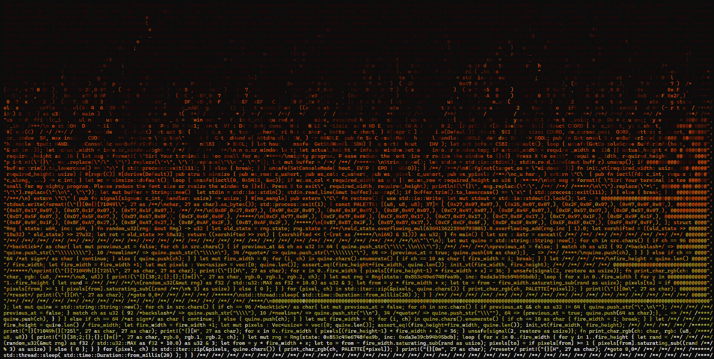

# A rusty quine on fire



# Building

## Building manually
Copy the output below (section: The Quine) into a file `quine.rs` and compile with:
```
rustc -o quine.exe quine.rs
```
Then run with:
```
./quine.exe
```
Works on both LInux and Windows.


## OR: Using the build scripts

- Windows

    ```
    build.bat
    ```

- Unix
    ```
    ./build.sh
    ```

Both generate a binary named `stage2`.

# The Quine

```
use std::ffi::{c_int, c_ulong, c_ushort}; #[cfg(target_os = "windows")] fn init_vt(required_width: usize, required_height: usize) { use std::ffi::{c_void, c_short}; type HANDLE = *mut c_void; type DW = c_ulong; type BOOL = c_int; /***/
const SOH: DW = -11i32 as DW; const EPO: DW = 0x1; const EVTP: DW = 0x4; const IHV: HANDLE = -1isize as HANDLE; const EWEAO: DW = 0x2; #[repr(C)] #[derive(Default)] struct COORD { x: c_short, y: c_short, } #[repr(C)] /**/ /**/ /******/
#[derive(Default)] struct SR { left: c_short, top: c_short, right: c_short, bottom: c_short, } #[repr(C)] #[derive(Default)] struct CSBI { dw_size: COORD, dw_cursor_pos: COORD, wattrs: c_ushort, sr_window: SR, maxwinsize: COORD, } /**/
extern "system" { pub fn GetStdHandle( nStdHandle: DW, ) -> HANDLE; pub fn SetConsoleMode( hConsoleHandle: HANDLE, dwMode: DW ) -> BOOL; pub fn GetConsoleScreenBufferInfo( hConsoleOutput: HANDLE, lpConsoleScreenBufferInfo: *mut /*****/
CSBI ) -> BOOL; } let hout = unsafe{ GetStdHandle(SOH) }; assert!( hout != IHV ); let mut info = CSBI::default(); loop { unsafe{GetConsoleScreenBufferInfo(hout, &mut info)}; let actual_width = info.sr_window.right - /**/ /**/ /**/ /**/
info.sr_window.left; let actual_height = info.sr_window.bottom - info.sr_window.top; if actual_width < required_width as i16 || actual_height < required_height as i16 { let msg = format!( "Sir! Your terminal is too small for my /*****/
mighty program. Please reduce the font size or resize the window to {}x{}. Press X to exit", required_width, required_height); println!("{}", msg.replace("/", "").replace("*", "").replace("\n", "")); let mut buffer = /**/ /**/ /******/
String::new(); let stdin = std::io::stdin(); stdin.read_line(&mut buffer).unwrap(); if buffer.trim().to_lowercase() == "x" { std::process::exit(111); } } else { break; } } unsafe{SetConsoleMode( hout, EVTP | EPO | EWEAO)}; } /**/ /***/
#[cfg(not(target_os = "windows"))] fn init_vt(required_width: usize, required_height: usize) { #[repr(C)] #[derive(Default)] pub struct winsize { pub ws_row: c_ushort, pub ws_col: c_ushort, pub ws_xpixel: c_ushort, pub ws_ypixel: /***/
c_ushort, } extern "C" { pub fn ioctl(fd: c_int, request: c_ulong, ...) -> c_int; } let wc = winsize::default(); loop { unsafe{ioctl(0, 0x5413, &wc)}; if wc.ws_col < required_width as u16 || wc.ws_row < required_height as u16 { /*****/
let msg = format!( "Sir! Your terminal is too small for my mighty program. Please reduce the font size or resize the window to {}x{}. Press X to exit", required_width, required_height); println!("{}", msg.replace("/", /**/ /**/ /*****/
"").replace("*", "").replace("\n", "")); let mut buffer = String::new(); let stdin = std::io::stdin(); stdin.read_line(&mut buffer).unwrap(); if buffer.trim().to_lowercase() == "x" { std::process::exit(111); } } else { break; } } /***/
} extern "C" { pub fn signal(signum: c_int, handler: usize) -> usize; } #[no_mangle] pub extern "C" fn restore() { use std::io::Write; let mut stdout = std::io::stdout().lock(); let _ = stdout.write(format!("{}[0m{}[?1049l", 27 as /**/
char, 27 as char).as_bytes()); std::process::exit(1); } const PALETTE: [(u8, u8, u8); 37]= [ (0x27,0x07,0x07,), (0x25,0x07,0x07,), (0x2F,0x0F,0x07,), (0x47,0x0F,0x07,), (0x57,0x17,0x07,), (0x67,0x1F,0x07,), (0x77,0x1F,0x07,), /**/ /**/
(0x8F,0x27,0x07,), (0x9F,0x2F,0x07,), (0xAF,0x3F,0x07,), (0xBF,0x47,0x07,), (0xC7,0x47,0x07,), (0xDF,0x4F,0x07,), (0xDF,0x57,0x07,), (0xDF,0x57,0x07,), (0xD7,0x5F,0x07,), (0xD7,0x5F,0x07,), (0xD7,0x67,0x0F,), (0xCF,0x6F,0x0F,), /*****/
(0xCF,0x77,0x0F,), (0xCF,0x7F,0x0F,), (0xCF,0x87,0x17,), (0xC7,0x87,0x17,), (0xC7,0x8F,0x17,), (0xC7,0x97,0x1F,), (0xBF,0x9F,0x1F,), (0xBF,0x9F,0x1F,), (0xBF,0xA7,0x27,), (0xBF,0xA7,0x27,), (0xBF,0xAF,0x2F,), (0xB7,0xAF,0x2F,), /*****/
(0xB7,0xB7,0x2F,), (0xB7,0xB7,0x37,), (0xCF,0xCF,0x6F,), (0xDF,0xDF,0x9F,), (0xEF,0xEF,0xC7,), (0xFF,0xFF,0xFF,), ]; struct Rng { state: u64, inc: u64, } fn random_u32(rng: &mut Rng) -> u32 { let old_state = rng.state; rng.state = /**/
old_state.overflowing_mul(6364136223846793005).0.overflowing_add(rng.inc | 1).0; let xorshifted = ((old_state >> 18u32) ^ old_state) >> 27u32; let rot = old_state >> 58u32; return ((xorshifted >> rot) | (xorshifted << (-(rot as /*****/
i64) & 31))) as u32; } fn main() { let src : &str = concat!( /**/ /**/ /**/ /**/ /**/ /**/ /**/ /**/ /**/ /**/ /**/ /**/ /**/ /**/ /**/ /**/ /**/ /**/ /**/ /**/ /**/ /**/ /**/ /**/ /**/ /**/ /**/ /**/ /**/ /**/ /**/ /**/ /**/ /**/ /**/
"use std::ffi::{c_int, c_ulong, c_ushort}; #[cfg(target_os = \"windows\")] fn init_vt(required_width: usize, required_height: usize) { use std::ffi::{c_void, c_short}; type HANDLE = *mut c_void; type DW = c_ulong; type BOOL = @@@@@@@",
"c_int; /***/\nconst SOH: DW = -11i32 as DW; const EPO: DW = 0x1; const EVTP: DW = 0x4; const IHV: HANDLE = -1isize as HANDLE; const EWEAO: DW = 0x2; #[repr(C)] #[derive(Default)] struct COORD { x: c_short, y: c_short, } @@@@@@@@@@@@",
"#[repr(C)] /**/ /**/ /******/\n#[derive(Default)] struct SR { left: c_short, top: c_short, right: c_short, bottom: c_short, } #[repr(C)] #[derive(Default)] struct CSBI { dw_size: COORD, dw_cursor_pos: COORD, wattrs: c_ushort, @@@@@@",
"sr_window: SR, maxwinsize: COORD, } /**/\nextern \"system\" { pub fn GetStdHandle( nStdHandle: DW, ) -> HANDLE; pub fn SetConsoleMode( hConsoleHandle: HANDLE, dwMode: DW ) -> BOOL; pub fn GetConsoleScreenBufferInfo( @@@@@@@@@@@@@@@@",
"hConsoleOutput: HANDLE, lpConsoleScreenBufferInfo: *mut /*****/\nCSBI ) -> BOOL; } let hout = unsafe{ GetStdHandle(SOH) }; assert!( hout != IHV ); let mut info = CSBI::default(); loop { unsafe{GetConsoleScreenBufferInfo(hout, @@@@@@",
"&mut info)}; let actual_width = info.sr_window.right - /**/ /**/ /**/ /**/\ninfo.sr_window.left; let actual_height = info.sr_window.bottom - info.sr_window.top; if actual_width < required_width as i16 || actual_height < @@@@@@@@@@@@",
"required_height as i16 { let msg = format!( \"Sir! Your terminal is too small for my /*****/\nmighty program. Please reduce the font size or resize the window to {}x{}. Press X to exit\", required_width, required_height); @@@@@@@@@@",
"println!(\"{}\", msg.replace(\"/\", \"\").replace(\"*\", \"\").replace(\"\\n\", \"\")); let mut buffer = /**/ /**/ /******/\nString::new(); let stdin = std::io::stdin(); stdin.read_line(&mut buffer).unwrap(); if @@@@@@@@@@@@@@@@@@@@",
"buffer.trim().to_lowercase() == \"x\" { std::process::exit(111); } } else { break; } } unsafe{SetConsoleMode( hout, EVTP | EPO | EWEAO)}; } /**/ /***/\n#[cfg(not(target_os = \"windows\"))] fn init_vt(required_width: usize, @@@@@@@@@",
"required_height: usize) { #[repr(C)] #[derive(Default)] pub struct winsize { pub ws_row: c_ushort, pub ws_col: c_ushort, pub ws_xpixel: c_ushort, pub ws_ypixel: /***/\nc_ushort, } extern \"C\" { pub fn ioctl(fd: c_int, request: @@@@",
"c_ulong, ...) -> c_int; } let wc = winsize::default(); loop { unsafe{ioctl(0, 0x5413, &wc)}; if wc.ws_col < required_width as u16 || wc.ws_row < required_height as u16 { /*****/\nlet msg = format!( \"Sir! Your terminal is too @@@@@@",
"small for my mighty program. Please reduce the font size or resize the window to {}x{}. Press X to exit\", required_width, required_height); println!(\"{}\", msg.replace(\"/\", /**/ /**/ /*****/\n\"\").replace(\"*\", @@@@@@@@@@@@@@@",
"\"\").replace(\"\\n\", \"\")); let mut buffer = String::new(); let stdin = std::io::stdin(); stdin.read_line(&mut buffer).unwrap(); if buffer.trim().to_lowercase() == \"x\" { std::process::exit(111); } } else { break; } } @@@@@@@@@@",
"/***/\n} extern \"C\" { pub fn signal(signum: c_int, handler: usize) -> usize; } #[no_mangle] pub extern \"C\" fn restore() { use std::io::Write; let mut stdout = std::io::stdout().lock(); let _ = @@@@@@@@@@@@@@@@@@@@@@@@@@@@@@@@@@@",
"stdout.write(format!(\"{}[0m{}[?1049l\", 27 as /**/\nchar, 27 as char).as_bytes()); std::process::exit(1); } const PALETTE: [(u8, u8, u8); 37]= [ (0x27,0x07,0x07,), (0x25,0x07,0x07,), (0x2F,0x0F,0x07,), (0x47,0x0F,0x07,), @@@@@@@@@@",
"(0x57,0x17,0x07,), (0x67,0x1F,0x07,), (0x77,0x1F,0x07,), /**/ /**/\n(0x8F,0x27,0x07,), (0x9F,0x2F,0x07,), (0xAF,0x3F,0x07,), (0xBF,0x47,0x07,), (0xC7,0x47,0x07,), (0xDF,0x4F,0x07,), (0xDF,0x57,0x07,), (0xDF,0x57,0x07,), @@@@@@@@@@@@",
"(0xD7,0x5F,0x07,), (0xD7,0x5F,0x07,), (0xD7,0x67,0x0F,), (0xCF,0x6F,0x0F,), /*****/\n(0xCF,0x77,0x0F,), (0xCF,0x7F,0x0F,), (0xCF,0x87,0x17,), (0xC7,0x87,0x17,), (0xC7,0x8F,0x17,), (0xC7,0x97,0x1F,), (0xBF,0x9F,0x1F,), @@@@@@@@@@@@@@",
"(0xBF,0x9F,0x1F,), (0xBF,0xA7,0x27,), (0xBF,0xA7,0x27,), (0xBF,0xAF,0x2F,), (0xB7,0xAF,0x2F,), /*****/\n(0xB7,0xB7,0x2F,), (0xB7,0xB7,0x37,), (0xCF,0xCF,0x6F,), (0xDF,0xDF,0x9F,), (0xEF,0xEF,0xC7,), (0xFF,0xFF,0xFF,), ]; struct @@@@",
"Rng { state: u64, inc: u64, } fn random_u32(rng: &mut Rng) -> u32 { let old_state = rng.state; rng.state = /**/\nold_state.overflowing_mul(6364136223846793005).0.overflowing_add(rng.inc | 1).0; let xorshifted = ((old_state >> @@@@@@",
"18u32) ^ old_state) >> 27u32; let rot = old_state >> 58u32; return ((xorshifted >> rot) | (xorshifted << (-(rot as /*****/\ni64) & 31))) as u32; } fn main() { let src : &str = concat!( /**/ /**/ /**/ /**/ /**/ /**/ /**/ /**/ @@@@@@@",
"/**/ /**/ /**/ /**/ /**/ /**/ /**/ /**/ /**/ /**/ /**/ /**/ /**/ /**/ /**/ /**/ /**/ /**/ /**/ /**/ /**/ /**/ /**/ /**/ /**/ /**/ /**/\n\"`\"\n); let mut quine = std::string::String::new(); for ch in src.chars() { if ch == 96 @@@@@@",
"/*backtick*/ as char{ let mut previous_at = false; for ch in src.chars() { if previous_at && ch as u32 != 64 { quine.push_str(\"\\\",\\n\\\"\"); /**/ /**/ /**/\nprevious_at = false; } match ch as u32 { 92 /*backslash*/ => @@@@@@@@@@",
"quine.push_str(\"\\\\\\\\\"), 10 /*newline*/ => quine.push_str(\"\\\\n\"), 34 /*quote*/ => quine.push_str(\"\\\\\\\"\"), 64 => {previous_at = true; quine.push(64 as char);}, _ => /**/ /****/\nquine.push(ch), } } } else if ch == @@@@",
"64 /*at sign*/ as char { continue; } else { quine.push(ch); } } let mut fire_width = 0; for (i, ch) in quine.chars().enumerate() { if ch == 10 as char { fire_width = i; break; } } let /**/ /**/ /***/\nfire_height = quine.len() @@@@@",
"/ fire_width; let fire_width = fire_width +1; let mut pixels : Vec<usize> = vec![0; quine.len()]; assert_eq!(fire_height*fire_width, quine.len()); init_vt(fire_width, fire_height); /**/ /**/ /**/ /**/ @@@@@@@@@@@@@@@@@@@@@@@@@@@@@@@",
"/******/\nprint!(\"{}[?1049h{}[?25l\", 27 as char, 27 as char); print!(\"{}[H\", 27 as char); for x in 0..fire_width { pixels[(fire_height-1) * fire_width + x] = 36; } unsafe{signal(2, restore as usize)}; fn print_char_rgb(ch: @@@@@",
"char, rgb: (u8, /****/\nu8, u8)) { print!(\"{}[38;2;{};{};{}m{}\", 27 as char, rgb.0, rgb.1, rgb.2, ch); } let mut rng = Rng{state: 0x853c49e6748fea9b, inc: 0xda3e39cb94b95bdb}; loop { for x in 0..fire_width { for y in @@@@@@@@@@@@@",
"1..fire_height { let rand = /**/ /**/ /**/\n(random_u32(&mut rng) as f32 / std::u32::MAX as f32 * 10.0) as u32 & 3; let from = y * fire_width + x; let to = from - fire_width.saturating_sub(rand as usize); pixels[to] = if @@@@@@@@@@@",
"pixels[from] >= 1 { pixels[from].saturating_sub((rand /**/\n% 3) as usize) } else { 0 }; } } for (pixel, ch) in std::iter::zip(&pixels, quine.chars()) { print_char_rgb(ch, PALETTE[*pixel]); } print!(\"{}[0m\", 27 as char); @@@@@@@@@",
"/*reset*/ print!(\"{}[H\", 27 as char); /*goto 0,0*/ /**/ /**/ /**/ /******/\nstd::thread::sleep( std::time::Duration::from_millis(20) ); } } /**/ /**/ /**/ /**/ /**/ /**/ /**/ /**/ /**/ /**/ /**/ /**/ /**/ /**/ /**/ /**/ /**/ @@@@@",
"/**/ /**/ /**/ /**/ /**/ /**/ /**/ /**/ /**/ /**/ /**/ /**/ /**/ /**/ /**/ /**/ /****/\n@@@@@@@@@@@@@@@@@@@@@@@@@@@@@@@@@@@@@@@@@@@@@@@@@@@@@@@@@@@@@@@@@@@@@@@@@@@@@@@@@@@@@@@@@@@@@@@@@@@@@@@@@@@@@@@@@@@@@@@@@@@@@@@@@@@@@@@@@@@@@@@@@"
); let mut quine = std::string::String::new(); for ch in src.chars() { if ch == 96 /*backtick*/ as char{ let mut previous_at = false; for ch in src.chars() { if previous_at && ch as u32 != 64 { quine.push_str("\",\n\""); /**/ /**/ /**/
previous_at = false; } match ch as u32 { 92 /*backslash*/ => quine.push_str("\\\\"), 10 /*newline*/ => quine.push_str("\\n"), 34 /*quote*/ => quine.push_str("\\\""), 64 => {previous_at = true; quine.push(64 as char);}, _ => /**/ /****/
quine.push(ch), } } } else if ch == 64 /*at sign*/ as char { continue; } else { quine.push(ch); } } let mut fire_width = 0; for (i, ch) in quine.chars().enumerate() { if ch == 10 as char { fire_width = i; break; } } let /**/ /**/ /***/
fire_height = quine.len() / fire_width; let fire_width = fire_width +1; let mut pixels : Vec<usize> = vec![0; quine.len()]; assert_eq!(fire_height*fire_width, quine.len()); init_vt(fire_width, fire_height); /**/ /**/ /**/ /**/ /******/
print!("{}[?1049h{}[?25l", 27 as char, 27 as char); print!("{}[H", 27 as char); for x in 0..fire_width { pixels[(fire_height-1) * fire_width + x] = 36; } unsafe{signal(2, restore as usize)}; fn print_char_rgb(ch: char, rgb: (u8, /****/
u8, u8)) { print!("{}[38;2;{};{};{}m{}", 27 as char, rgb.0, rgb.1, rgb.2, ch); } let mut rng = Rng{state: 0x853c49e6748fea9b, inc: 0xda3e39cb94b95bdb}; loop { for x in 0..fire_width { for y in 1..fire_height { let rand = /**/ /**/ /**/
(random_u32(&mut rng) as f32 / std::u32::MAX as f32 * 10.0) as u32 & 3; let from = y * fire_width + x; let to = from - fire_width.saturating_sub(rand as usize); pixels[to] = if pixels[from] >= 1 { pixels[from].saturating_sub((rand /**/
% 3) as usize) } else { 0 }; } } for (pixel, ch) in std::iter::zip(&pixels, quine.chars()) { print_char_rgb(ch, PALETTE[*pixel]); } print!("{}[0m", 27 as char); /*reset*/ print!("{}[H", 27 as char); /*goto 0,0*/ /**/ /**/ /**/ /******/
std::thread::sleep( std::time::Duration::from_millis(20) ); } } /**/ /**/ /**/ /**/ /**/ /**/ /**/ /**/ /**/ /**/ /**/ /**/ /**/ /**/ /**/ /**/ /**/ /**/ /**/ /**/ /**/ /**/ /**/ /**/ /**/ /**/ /**/ /**/ /**/ /**/ /**/ /**/ /**/ /****/
```
